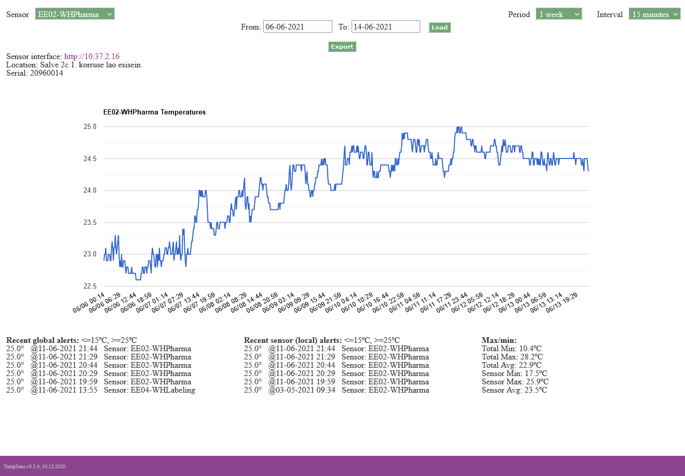
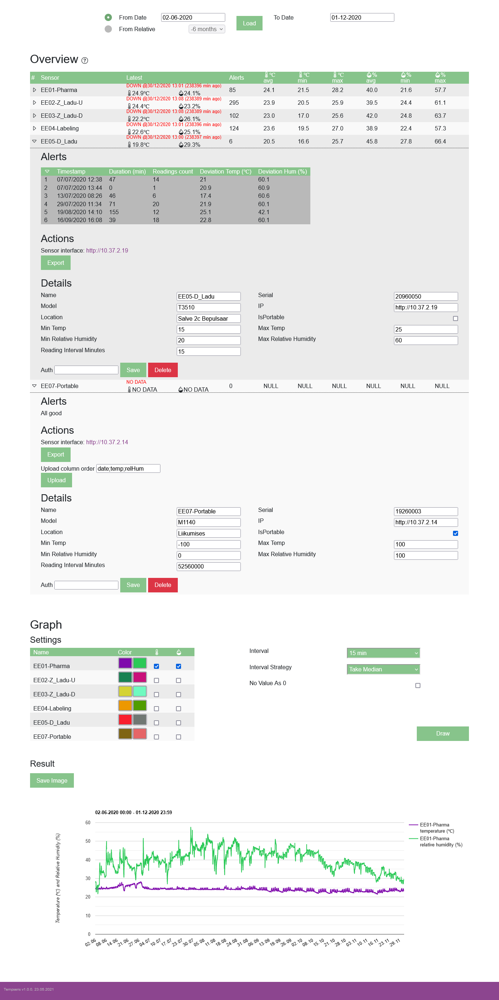

# Tempsens

## Vendor dependencies

Current dependencies:
* autoloader(No dependencies)

Update dependencies from composer.json
```
composer update
```

## Database
```
+------------------------------------+      +---------------------------------------------+                                                                                                              
|               Sensors              |      |               SensorReading                 |                                                                                                              
+--------------+---------------+-----+      +--------------+----------------+-------------+                                                                                                              
| Id           | string!       | PK  |      | Id           | string!        | PK          |                                                                                                              
| Name         | string!       |     |1....*| SensorId     | string!        | FK(sensors) |                                                                                                              
| Serial       | string!       |     |      | Temp         | decimal(18,1)! |             |                                                                                                              
| Model        | string!       |     |      | RelHum       | decimal(18,1)! |             |                                                                           
| Ip           | string!       |     |      | DateRecorded | string!        | Idx         |                                                                           
| Location     | string!       |     |      | DateAdded    | string?        |             |                                                                        
| IsPortable   | bool!         |     |      +--------------+----------------+-------------+                                                                                                        
| MinTemp      | decimal(18,1)!|     |                                                                                                              
| MaxTemp      | decimal(18,1)!|     |       Date format is YYYYMMDDHHmm                                                                                                       
| MinRelHum    | decimal(18,1)!|     |       DateAdded is null for not isPortable sensors                                                                                                        
| MaxRelHum    | decimal(18,1)!|     |                                                                                                              
| ReadingInterv| int!          |     |                                                                                                               
+--------------+---------------+-----+
```                                                                                                           

## patch notes

### 0.3.4



### 1.0.0



Notes:
* Remade database (removed: alarms, emails, emails_to_sensor, parms, portable and queue. Redesigned sensor and sensorReading)
* Removed unnecessary values sent by sensors from being saved to sensorReading
* Removed scripts/alarms.php - Email sending didn't work
* Removed confusing alerts(global vs sensor) and Max/min(total vs sensor)
* Removed ambiguous sensor state .png balls
* Removed unused Composer dependencies(php-jwt, Guzzle, oauth2-client, random_compaq, Phpmailer, http-message, getallHeaders, oauth-keycloak, Symfony)
* Replaced Db generated int Ids with server-side 22 char base64 random generated ones
* Added Db default data initialization script and migrations
* Now all sensors are shown together and can be graphed together
* Added relative humidity to overview and graph
* Fixed bugs with selecting end date changing start date value
* Added CRUD functionality to sensor
* Added cache file for fast last sensor readings
* Added options for chart drawing
* Added option to export graph as screenshot
* Added option to upload CSV data to portable sensors
* Restructured code
* Separated views and controllers
* Added partial views
* Created favicon
* Used new PHP 8.0 and below features (function parameter and return types, named arguments, constructor property promotion)

by: Karl Oskar Anderson

## Future

### Todo
Test SensorReading sql performance in non localhost environment. 
I had a weird situation where selecting 1 more field (dateAdded) significantly slows down query even if the field is always empty/null. 

Change initializer.php to load data from real DB.

Remove bash crud job (scripts/alarms.php) that will not work anymore - I don't think it ever did.
