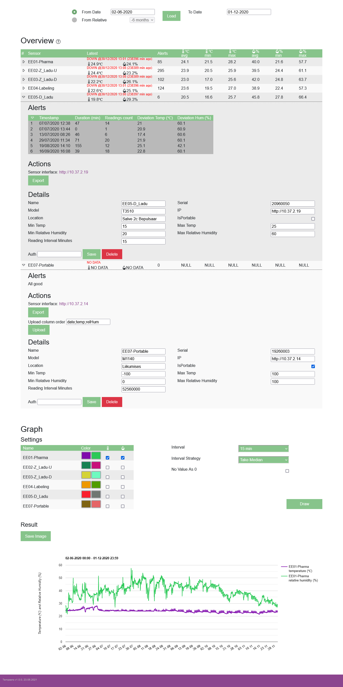

# Tempsens

Sirowa warehouse sensor temperature and humidity data visualization logserver.

## Installation
### Local

1. Download/`git clone` the project
2. Create `.env` file from `.env_template` file and adjust parameters
3. Run `composer install` in root folder to generate dependencies and autoloading. If the command throws error '`Root composer.json requires PHP extension ext-soap ...`' uncomment `extension=soap` attribute in the `php.ini` global PHP config file.
4. Open terminal and `cd site`
5. (if you have data files) Copy `backupCSV` folder to `site/db` and generate db with sample data `php -r "require './db/Initializer.php'; App\db\Initializer::Initialize();"`
6. Start php server by running command `php -S localhost:8080`
7. Open in browser http://127.0.0.1:8080

Possible errors:  
* No database access - Go into your `php.ini` file and uncomment `extension=pdo_mysql`


### Docker
1. Follow 1. and 2. step from local install
2. Run `docker-compose up -d` in `docker` directory
3. Install dependencies `docker-compose exec tempsens-app composer install`
4. Open in browser http://127.0.0.1:8000


## Dependencies

### Server side
* [phpdotenv](https://github.com/vlucas/phpdotenv) - Loads environment variables from `.env` to `getenv()`, `$_ENV` and `$_SERVER` automagically.
* [Slim](https://github.com/slimphp/Slim) - PHP micro framework that helps you quickly write simple yet powerful web applications and APIs.
* [Valinor](https://github.com/CuyZ/Valinor) - hydrated JSON deserialization to class instance

### Client side
* [Reset CSS](https://meyerweb.com/eric/tools/css/reset) - cross browser style inconsistency remover
* [Bootstrap Icons](https://icons.getbootstrap.com) - Different icons (class tags `bi bi-`)
* [jQuery](https://jquery.com) - Needed for jQuery UI
* [jQuery UI](https://jqueryui.com/datepicker) - Cross browser identical calendar/datepicker, kinda stupid for such a simple thing
* [bootstrap](https://getbootstrap.com) - HTML, CSS and JavaScript framework, Used components: collapsable, modal
* [Nunjucks](https://github.com/mozilla/nunjucks) - Templating engine (abandoned, but useful) (IN PROGRESS)
* [Google Chart](https://developers.google.com/chart) (charts/loader.js) - Drawing charts
* [Day.js](https://day.js.org/) (with plugins: customParseFormat) - date parsing, needed for chart data manipulation


## Documentation

### General documentation:  
[IT documentation - Temperature and Humidity Monitoring in the Baltic Warehouse [link]](https://drive.google.com/drive/folders/1U-jQZR57uo2S5RYVUKuww7ev0e6jwKyZ?usp=sharing)

### API 
Documentation for physical sensor API and Tempsens logserver API:  
[API Documentation](_documents/api.md)


### Database Schema

[Note] Disable word wrap to display table correctly (alt + z in VSCode). Viewing markdown files through Github is not an issue. 

```
+------------------------------------+      +---------------------------------------------+                                                                                                              
|               Sensors              |      |               SensorReading                 |                                                                                                              
+--------------+---------------+-----+      +--------------+----------------+-------------+                                                                                                              
| Id           | string!       | PK  |      | Id           | string!        | PK          |                                                                                                              
| Name         | string!       |     |1....*| SensorId     | string!        | FK(sensors) |                                                                                                              
| Serial       | string!       |     |      | Temp         | decimal(18,1)! |             |                                                                                                              
| Model        | string!       |     |      | RelHum       | decimal(18,1)! |             |                                                                           
| Ip           | string!       |     |      | DateRecorded | string!        | Idx         |                                                                           
| Location     | string!       |     |      | DateAdded    | string?        |             |                                                                        
| IsPortable   | bool!         |     |      +--------------+----------------+-------------+                                                                                                        
| MinTemp      | decimal(18,1)!|     |                                                                                                              
| MaxTemp      | decimal(18,1)!|     |                                                                                                                                         
| MinRelHum    | decimal(18,1)!|     |                                                                                                                                                           
| MaxRelHum    | decimal(18,1)!|     |                                                                                                              
| ReadingInterv| int!          |     |                                                                                                               
+--------------+---------------+-----+                                                                        


+------------------------------------+
|                Cache               |
+--------------+---------------+-----+
| Id           | string!       | PK  |
| Key0         | string!       |     |
| Content      | string!       |     |
+--------------+---------------+-----+
```                                                                                                           
[Tip] Use VSCode multiline editing shortcuts (alt + mouse_click; alt + ctrl + down/up arrow) to edit DB schema

Date format is YYYYMMDDHHmm. This makes ordering SensorReadings by date easy (eg 13:42, 13.03.2021 becomes 202103131342)                
DateAdded is `null` for not isPortable sensors.  
Cache is `string` key to JSON `SensorReading[]` value for latest `SensorReading` values for all sensors.

## Testing

### Sample data for Database
Script `site/db/Initializer.php` generates new database tables and imports data from local CSV files.
Modify the script to fit your needs then run `php Initializer.php` to execute the script.

Sample CSV data files [are available on request [link]](https://drive.google.com/drive/folders/1l-BW7Rwa57Zx1lE251V4ASbUaw9odJsC?usp=sharing).
Create directory `site/db/backupCSV` and place the data there.

### Test web upload:
Sample CSV data files [are available on request [link]](https://drive.google.com/drive/folders/1l-BW7Rwa57Zx1lE251V4ASbUaw9odJsC?usp=sharing) to test portable sensor's sensor readings import functionality.

### Test API
Api request endpoint and body is described in [API](#API).


## Versioning
Versioning follows major.minor.patch three digit numbering:
* major - Breaking database changes 
* minor - API changes or 5+ patch changes worth documenting
* patch - Small tweaks

### 0.1.0
15.01.2020 by Indrek Hiie - Soap Data Collector 

### 0.2.0
27.02.2020 by Timm Soodla - initial GUI version

### 0.3.0
30.12.2020 by Indrek Hiie - moved to PDO MySQL driver, sensors now in DB, more modular code and some bugfixes applied

### 0.3.4 (was used in production)

[Preview image](_documents/images/version_0.3.4.png)

### 0.3.5 (didn't reach production)
24.01.2021 - watchdog added

### 1.0.0



Notes:
* Remade database (removed: alarms, emails, emails_to_sensor, parms, portable and queue. Redesigned sensor and sensorReading)
* Removed unnecessary values sent by sensors from being saved to sensorReading
* Removed scripts/alarms.php - Email sending didn't work
* Removed confusing alerts(global vs sensor) and Max/min(total vs sensor)
* Removed ambiguous sensor state .png balls in v0.3.5
* Removed unused Composer dependencies(php-jwt, Guzzle, oauth2-client, random_compaq, Phpmailer, http-message, getallHeaders, oauth-keycloak, Symfony)
* Replaced Db generated int Ids with server-side 22 char base64 random generated ones
* Added Db default data initialization script and migrations
* Now all sensors are shown together and can be graphed together
* Added relative humidity to overview and graph
* Fixed bugs with selecting end date changing start date value
* Added CRUD functionality to sensor
* Added cache file for fast last sensor readings
* Added options for chart drawing
* Added option to export graph as screenshot
* Added option to upload CSV data to portable sensors
* Restructured code
* Separated views and controllers, following MVC design
* Added partial views
* Created favicon
* Used new PHP 8.0 and below features (function parameter and return types, named arguments, constructor property promotion)

Made with ❤️ by Karl Oskar Anderson

### 1.1.0
Notes:
* Update UI - Sensor info (Alerts, Actions, Details) are organized into clickable `nav` element buttons
* Change database table collation to binary. All field comparisons are now case sensitive.
* Remove dependency from existing database:
  * Update environment variable reading
  * Change database initializer to work with CSV files
* Refactor code, increase readability
* Fix a bug causing alert packing to result in a null pointer exception

Made with ❤️ by Karl Oskar Anderson
